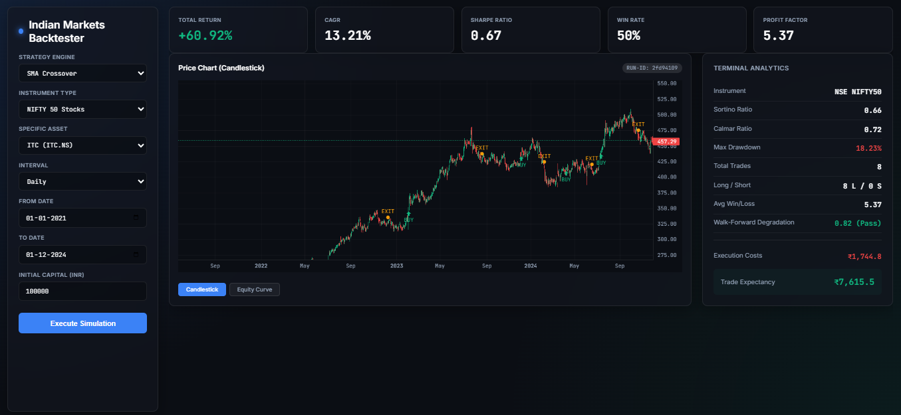
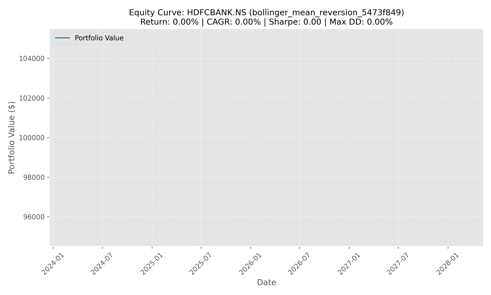
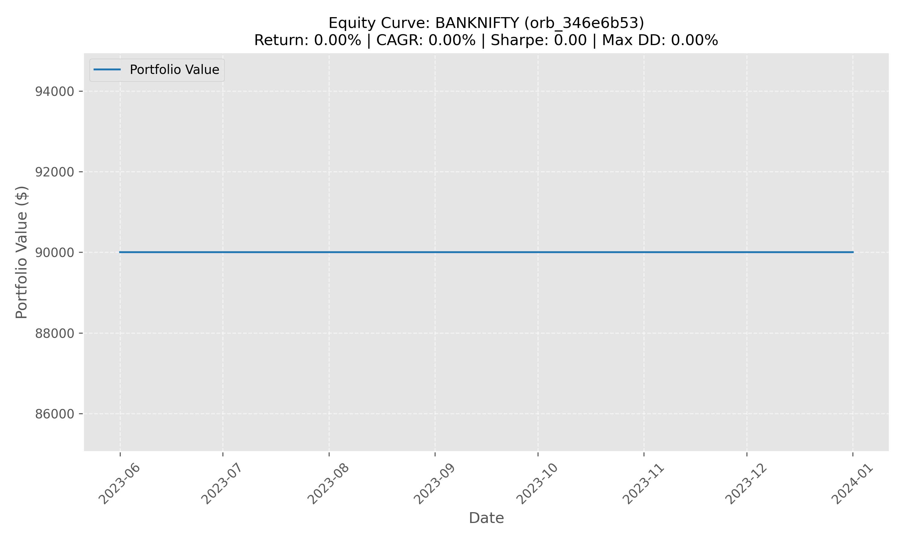

<div align='center'>
    <h1 align='center'> Stock Backtesting Pipeline </h1>
    <p align='center'> A production-ready, from-scratch algorithmic trading backtesting system built in pure Python for Indian financial markets (NSE, BSE, MCX, NCDEX, CDS). Features 10+ trading strategies, real transaction cost models, options pricing with Greeks, and an interactive web UI with candlestick charts. </p>
    <div>
        
        
        
        
        
    </div>
</div>


### Project Overview

*The goal of this project is to build a complete algorithmic trading backtesting platform from mathematical first principles — without relying on pandas, numpy, or backtrader — specifically engineered for Indian markets with exact regulatory costs, lot sizes, and trading calendars.*

- **Multi-Exchange Data:** Fetches OHLCV data from Yahoo Finance, NSE Bhavcopy, and Alpha Vantage for 200+ instruments across NSE, BSE, MCX, NCDEX, and CDS.

- **10+ Trading Strategies:** SMA Crossover, Bollinger Mean Reversion, VWAP, ORB, Pairs Trading, Cross-Sectional Momentum, RSI Divergence, Gap Fill, Donchian Breakout, and Weekly Straddle.

- **India-Specific Cost Models:** Exact 2024 transaction costs including STT, brokerage, exchange charges, SEBI fees, stamp duty, GST, and slippage — for equities, F&O, commodities, and forex.

- **Options Pricing Engine:** Black model implementation with Greeks (Delta, Gamma, Theta, Vega, Rho) and implied volatility solver for index options backtesting.

- **Interactive Web UI:** Glassmorphic dark-themed dashboard with candlestick charts, buy/sell markers, equity curves, and real-time KPI cards.

- **Walk-Forward Validation:** Prevents overfitting by testing strategies on truly unseen out-of-sample data with degradation analysis.

<div align='center'>
    
    <p align="center"><em>SMA Crossover Strategy — Equity Curve for RELIANCE.NS</em></p>
</div>


### Tools and Technologies

| Tool               | Purpose                                                        |
|--------------------|----------------------------------------------------------------|
| Python 3.9+        | Core language — all math and vector operations built from scratch |
| Flask              | Lightweight web server for the backtesting dashboard            |
| SQLite3            | Persistent storage for OHLCV data, backtest results, and trade logs |
| Matplotlib         | Server-side equity curve and signal chart generation            |
| Lightweight Charts | Interactive candlestick and area charts in the browser          |
| Requests           | HTTP client for Yahoo Finance, NSE, and Alpha Vantage APIs     |
| Pytest             | Unit testing for indicators, metrics, and backtester logic      |


### Pipeline Workflow

**(1)** Data Fetching:

- Fetches OHLCV data from Yahoo Finance API (primary), NSE Bhavcopy CSV (secondary), or Alpha Vantage (tertiary).

- Supports equities, indices, futures, options, commodities, ETFs, REITs, forex, and government securities.

- Built-in rate limiting, error handling, and local SQLite caching.

**(2)** Signal Generation:

- Runs technical indicators (SMA, EMA, RSI, MACD, Bollinger Bands, VWAP, ATR, Stochastic, Hurst Exponent) on the price data.

- Strategies evaluate indicator outputs to produce buy (+1), sell (-1), or hold (0) signals with reasoning.

**(3)** Backtesting Simulation:

- Event-driven portfolio simulator iterates row-by-row through OHLCV + signals.

- Tracks cash, position, entry price with stop loss, trailing stop, and take profit constraints.

- Enforces NSE intraday square-off at 15:15 and applies exact transaction costs.

**(4)** Performance Analysis:

- Calculates 15+ financial metrics: Total Return, CAGR, Sharpe, Sortino, Calmar, Max Drawdown, Win Rate, Profit Factor, Trade Expectancy, and Kelly Criterion.

- Generates equity curve charts and saves results to SQLite for historical comparison.

**(5)** Visualization:

- Web UI displays interactive candlestick charts with buy/sell markers overlaid on price.

- KPI cards show key metrics at a glance. Terminal analytics panel shows detailed trade statistics.


### Performance Metrics & KPIs

The dashboard displays real-time KPI cards and a detailed terminal analytics panel after each backtest run.

#### KPI Cards (Top Row)

| KPI | What It Measures | How to Interpret |
|-----|-----------------|------------------|
| **Total Return** | Overall % gain/loss from start to end | Positive = profitable strategy |
| **CAGR** | Compound Annual Growth Rate — annualized return | Compare against benchmark (NIFTY ~12% historically) |
| **Sharpe Ratio** | Return per unit of risk (volatility) | > 1.0 good, > 2.0 excellent, < 0 losing money |
| **Win Rate** | % of closed trades that were profitable | 40-60% is typical; depends on avg win/loss ratio |
| **Profit Factor** | Gross profit / Gross loss | > 1.0 profitable, > 2.0 strong, > 3.0 excellent |

#### Terminal Analytics (Right Panel)

| Metric | What It Measures | How to Interpret |
|--------|-----------------|------------------|
| **Sortino Ratio** | Like Sharpe but only penalizes downside volatility | Better for strategies with asymmetric returns |
| **Calmar Ratio** | CAGR / Max Drawdown | How much return per unit of worst-case pain |
| **Max Drawdown** | Largest peak-to-trough portfolio drop | Lower is better; > 30% is painful for most traders |
| **Total Trades** | Number of completed round-trip trades | More trades = more cost drag |
| **Long / Short** | Split of long vs short positions taken | Shows directional bias of the strategy |
| **Avg Win/Loss** | Average winning trade / Average losing trade | Must be > 1/(win rate) to be profitable |
| **Walk-Forward Degradation** | Out-of-sample / In-sample Sharpe ratio | 0.7–1.0 = robust, < 0.5 = likely overfitting |
| **Execution Costs** | Total transaction costs (STT, brokerage, exchange, SEBI, stamp, GST) | Real Indian market costs applied per trade |
| **Trade Expectancy** | Expected P&L per trade: (WinRate × AvgWin) − (LossRate × AvgLoss) | Positive = edge exists, negative = losing strategy |

#### Example Run — ITC.NS with SMA Crossover

*Settings: ITC.NS, SMA Crossover, Daily, 2021-01-01 to 2024-12-01, ₹1,00,000 capital*

| KPI Cards | |
|---|---|
| Total Return | **+60.92%** |
| CAGR | **13.21%** |
| Sharpe Ratio | **0.67** |
| Win Rate | **50%** |
| Profit Factor | **5.37** |

| Terminal Analytics | |
|---|---|
| Sortino Ratio | 0.66 |
| Calmar Ratio | 0.72 |
| Max Drawdown | 18.23% |
| Total Trades | 8 |
| Long / Short | 8 L / 0 S |
| Avg Win/Loss | 5.37 |
| Execution Costs | ₹1,744.80 |
| Trade Expectancy | ₹7,615.50 |

*ITC had a strong uptrend from 2021–2024. The SMA crossover captured it with a 50% win rate, but winning trades were 5.37× larger than losers — demonstrating that win rate alone doesn't determine profitability.*

<div align='center'>
    
    <p align="center"><em>ITC.NS — SMA Crossover Strategy (2021–2024) with KPI Cards, Candlestick Chart & Terminal Analytics</em></p>
</div>


### Strategies Included

| Strategy                     | Type            | Timeframe     | Best For                              |
|------------------------------|-----------------|---------------|---------------------------------------|
| SMA Crossover                | Trend           | Daily         | Large-cap equities, indices           |
| Bollinger Band Mean Reversion| Mean Reversion  | Daily/Intraday| Oversold/overbought conditions        |
| VWAP Mean Reversion          | Intraday        | 15m/5m        | Equity futures on volume spikes       |
| Opening Range Breakout (ORB) | Intraday        | 15m/5m/1m     | Nifty/BankNifty futures               |
| Cross-Sectional Momentum     | Factor          | Daily         | Multi-stock ranking portfolios        |
| Pairs Trading                | Market-Neutral  | Daily         | Cointegrated stock pairs              |
| RSI Divergence               | Momentum        | Daily         | Reversal identification               |
| Gap Fill                     | Mean Reversion  | Daily         | Overnight gap exploitation            |
| Donchian Breakout            | Breakout        | Daily         | Trend initiation                      |
| Weekly Straddle              | Options         | Weekly        | BankNifty theta decay                 |


### Project Structure

```text
Stock-Backtesting-Pipeline/
├── app.py                      # Flask web server (port 8080)
├── run.py                      # CLI entry point with argparse
├── config.py                   # Market timings, lot sizes, holidays, constants
├── requirements.txt
├── src/
│   ├── data_sources.py         # Multi-exchange data provider (200+ instruments)
│   ├── fetcher.py              # Yahoo Finance API client with OAuth support
│   ├── indicators.py           # 15+ technical indicators from scratch
│   ├── strategy.py             # 10 trading strategy implementations
│   ├── backtester.py           # Event-driven portfolio simulator
│   ├── options_backtester.py   # Black model options pricing & Greeks
│   ├── metrics.py              # 15+ financial performance metrics
│   ├── costs.py                # India transaction cost models (NSE/BSE/MCX/NCDEX/CDS)
│   ├── charts.py               # Matplotlib equity curve & signal plots
│   ├── orchestrator.py         # Main execution engine
│   ├── storage.py              # SQLite persistence layer
│   ├── nse_calendar.py         # Trading calendar & expiry dates
│   └── validation.py           # Walk-forward overfitting prevention
├── templates/
│   └── index.html              # Interactive web dashboard
├── static/
│   ├── app.css                 # Glassmorphic dark theme
│   └── charts/                 # Generated equity curve PNGs
├── tests/
│   ├── test_indicators.py
│   ├── test_metrics.py
│   └── test_backtester.py
└── data/
    └── stocks.db               # SQLite database
```


### Setting up the project in your machine

#### Prerequisites
- Python 3.9+

- pip

- Git

#### Clone the repository

```
git clone https://github.com/555aaditya/Stock-Backtesting-Pipeline.git
cd Stock-Backtesting-Pipeline
```

#### Create a virtual environment

```
python -m venv venv
```

Activate it:
```
# Windows
venv\Scripts\activate

# macOS/Linux
source venv/bin/activate
```

#### Install dependencies
```
pip install -r requirements.txt
```

#### Launch the web UI
```
python app.py
```
Visit ```http://localhost:8080``` in your browser to open the interactive dashboard.

<div align='center'>
    
    <p align="center"><em>Bollinger Mean Reversion — HDFCBANK.NS Equity Curve</em></p>
</div>

#### Run via CLI (alternative)
```
python run.py --ticker RELIANCE.NS --strategy sma_crossover --interval 1d --from 2023-01-01 --to 2024-01-01
```

Additional CLI examples:
```
# Pairs Trading
python run.py --pair RELIANCE.NS,SBIN.NS --strategy pairs_trading

# Multi-stock universe
python run.py --universe nifty50 --strategy cross_sectional_momentum --rebalance monthly
```

#### Run tests
```
python -m pytest tests/ -v
```

<div align='center'>
    
    <p align="center"><em>Opening Range Breakout — BANKNIFTY Equity Curve</em></p>
</div>

<div align='center'>
    
    <p align="center"><em>Bollinger Mean Reversion — SBIN.NS Equity Curve</em></p>
</div>

<div align='center'>
    
    <p align="center"><em>SMA Crossover — Gold Commodity Equity Curve</em></p>
</div>

<div align='center'>
    
    <p align="center"><em>SMA Crossover — USD/INR Forex Equity Curve</em></p>
</div>

#### Stopping the Program

| **Action**              | **Command**                                                  |
|-------------------------|--------------------------------------------------------------|
| **Stop Web Server**     | Press `CTRL+C` in the terminal running `app.py`              |
| **Stop CLI Backtest**   | Press `CTRL+C` in the terminal running `run.py`              |
